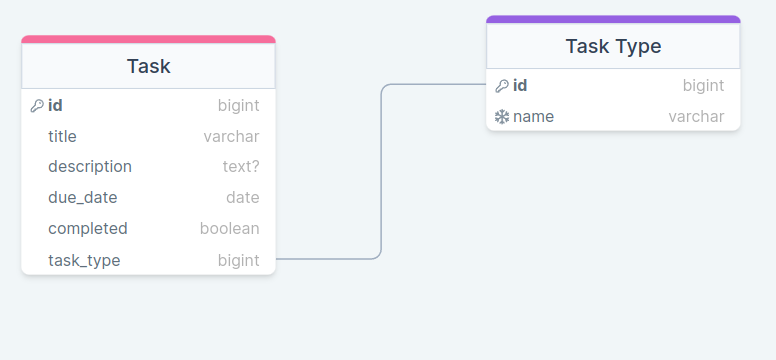
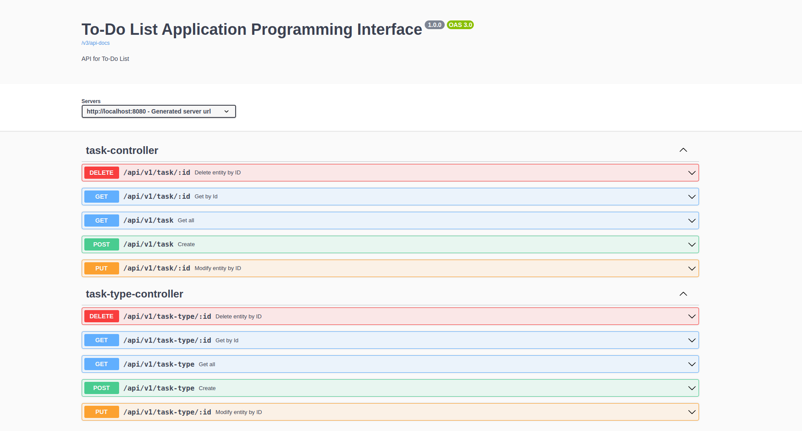

# TO - DO List API


## Rövid bemutató / Description
Ez az alkalmazás egy to-do list API, amely a Spring Boot keretrendszer-ben készült.
Lehetővé teszi a felhasználók számára, hogy létrehozzanak, lekérdezzenek, frissítsenek és töröljenek elemeket a teendő a listájukról.
Az API végpontokat biztosít az előbb említett tevékenységek végrehjatásához.

--------English below--------

This application is a to-do list API built using the Spring Boot framework. 
It allows users to create, read, update, and delete tasks on their to-do lists. 
The API provides endpoints for managing tasks, including adding new tasks, retrieving existing tasks, 
updating task details, and deleting tasks.

## Adatbázis séma / Database scheme


## OpenAPI dokumentáció / OpenAPI documentation
```bash
url: http://localhost:8080/swagger-ui/index.html
```
